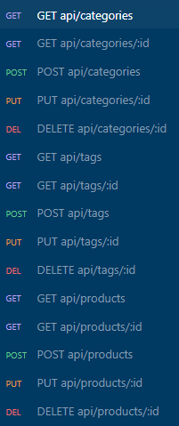

# e-Commerce Back End

[](https://opensource.org/licenses/MIT)

## Description

Internet retail, also known as **e-commerce**, is the largest sector of the electronics industry, generating an estimated $29 trillion in 2019. E-commerce platforms like Shopify and WooCommerce provide a suite of services to businesses of all sizes. Due to their prevalence, understanding the fundamental architecture of these platforms will benefit you as a full-stack web developer.

This project is the back end for a generic e-commerce site using one-to-many and many-to-many database relationships with Sequelize and MySQL.

The technologies used in this application are:

- [Node.js](https://nodejs.org/en/)
- [Express.js](https://expressjs.com/) to run the web server
- [MySQL](https://www.mysql.com/) to store the data
- [Sequelize](https://sequelize.org) to connect to the MySQL database from Node.js
- [dotenv](https://www.npmjs.com/package/dotenv) to store environmental variables

### User Story

```md
AS A manager at an internet retail company
I WANT a back end for my e-commerce website that uses the latest technologies
SO THAT my company can compete with other e-commerce companies
```

### Acceptance Criteria

```md
GIVEN a functional Express.js API
WHEN I add my database name, MySQL username, and MySQL password to an environment variable file
THEN I am able to connect to a database using Sequelize
WHEN I enter schema and seed commands
THEN a development database is created and is seeded with test data
WHEN I enter the command to invoke the application
THEN my server is started and the Sequelize models are synced to the MySQL database
WHEN I open API GET routes in Insomnia for categories, products, or tags
THEN the data for each of these routes is displayed in a formatted JSON
WHEN I test API POST, PUT, and DELETE routes in Insomnia
THEN I am able to successfully create, update, and delete data in my database
```

## Table of Contents

- [Installation](#installation)
- [Usage](#usage)
- [License](#license)
- [Contributing](#contributing)
- [Questions](#questions)

## Installation

After downloading the score code, run the following commands from the home directory.

```bash
npm i
```

## Usage

The application will be invoked by using the following command:

```bash
node server.js
```

As there is no public-facing views in this project, the user will need to consume the apis using a tool like [Insomnia](https://insomnia.rest/). The api endpoints are:



### Video

[WEBM Video Link](https://drive.google.com/file/d/1pQn7x_QwBq3fPjWPo1BNOVGSnG-IPg8a/view)

[MP4 Video Link](https://drive.google.com/file/d/1f2z4LFM_rUjYkcGqCCNSwPBrysbIOocV/view?usp=sharing)

## License

[](https://opensource.org/licenses/MIT)

This application is covered under the [MIT License](https://opensource.org/licenses/MIT).

## Contributing

As this project is part of an individual assignment for the University of Denver's Coding Bootcamp, it would be inappropriate for anyone else to contribute to this project.

## Questions

GitHub Link: [https://github.com/dpk5e7/e-commerce-back-end](https://github.com/dpk5e7/e-commerce-back-end)

Please contact me at Daniel.Kelly@du.edu with any additional questions you may have.
